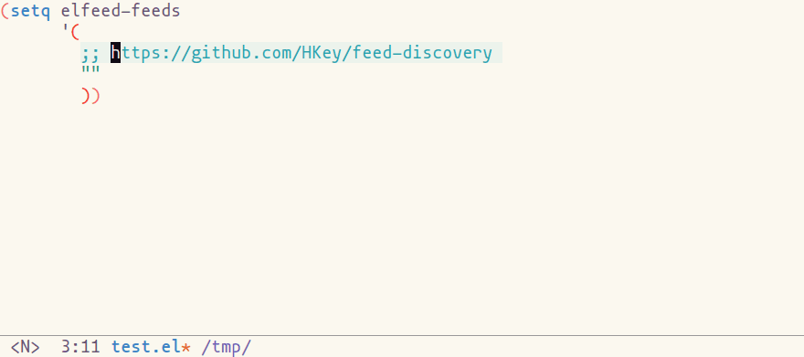

# feed-discovery
This package allows you to discover feed urls from a website url by
RSS/Atom autodiscovery.

This package has been created to help feed management of
[elfeed](https://github.com/skeeto/elfeed).



## Usage

You can copy a feed url by `M-x feed-discovery-copy-feed-url`.  
The command discover feed urls from input url and copy one of them.

## Requirements

- Emacs 25.1 or later
- [dash](https://github.com/magnars/dash.el)

## Installation

TODO: register to MELPA

Currently this package is not registered in any emacs lisp package archives.
So manual installation is needed.

Here is an example to install via package.el manually.
You can install this package by evaluating the code below.

```emacs-lisp
(with-temp-buffer
  (url-insert-file-contents "https://raw.githubusercontent.com/HKey/feed-discovery/master/feed-discovery.el")
  (package-install-from-buffer))
```

## Versioning

The versioning of feed-discovery follows [Semantic Versioning 2.0.0](https://semver.org/spec/v2.0.0.html)
